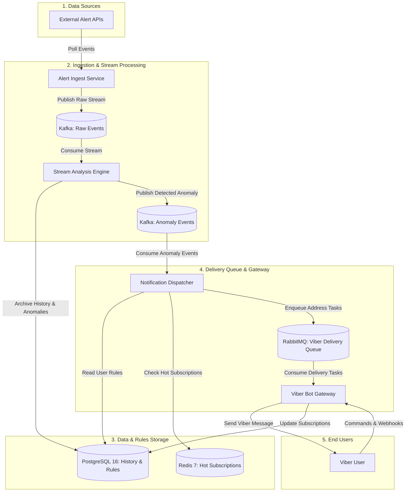

# Lodestar 🧭

**Lodestar** is a real-time event ingestion, historical archiving, and anomaly notification platform built on Java 21 and Spring Boot 3.3+.

---

## Domain & Core Business Concept

1. **Event Ingestion & Archiving:** Continuous collection of real-time state changes and durable time-series archiving for deep statistical analysis and research data sets.
2. **Automated Stream Analysis:** Real-time processing and preliminary anomaly detection on incoming event flows.
3. **Conditional Notification Dispatch:** Multi-channel alert routing (e.g., Viber) triggered upon specific threshold conditions or detected anomalies, with guaranteed delivery and retries.

---

## Architecture & Tech Stack



### Tech Stack:
* **Language & Runtime:** Java 21, Spring Boot 3.3+ (Spring Data JPA, Spring Security, Spring Web, RestClient)
* **Event Streaming:** Apache Kafka (KRaft mode, spring-kafka)
* **Message Queue:** RabbitMQ (spring-amqp, AMQP 0-9-1, DLX & Retry Exchanges)
* **Persistence & Caching:** PostgreSQL 16, Redis 7
* **Orchestration & Cloud:** Docker, Kubernetes (Deployments, Services, Ingress, HPA), Helm
* **Observability:** Prometheus, Grafana, Spring Boot Actuator, Micrometer Observation API
* **Testing:** Testcontainers (Kafka, RabbitMQ, PostgreSQL), JUnit 5, AssertJ

---

## Quickstart (Local Infrastructure)

Spin up the local containerized environment (PostgreSQL, Redis, Kafka KRaft, RabbitMQ with Management UI):

```bash
docker-compose up -d
```

### Services & Endpoints:
* **PostgreSQL:** `localhost:5432` (db: `lodestar_db`, user: `postgres`)
* **Redis:** `localhost:6379`
* **Apache Kafka (KRaft):** `localhost:9092`
* **RabbitMQ Management UI:** `http://localhost:15672` (guest / guest)
