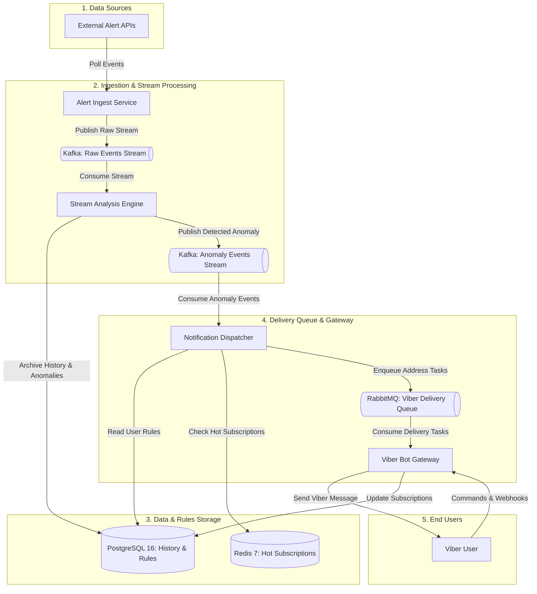

# Lodestar 🧭

[](https://github.com/Olezha/Lodestar/actions/workflows/ci.yml)

**Lodestar** is a real-time event ingestion, historical archiving, and anomaly notification platform built on Java 21 and Spring Boot 3.3+.

---

## Domain & Core Business Concept

1. **Event Ingestion & Archiving:** Continuous collection of real-time state changes and durable time-series archiving for deep statistical analysis and research data sets.
2. **Automated Stream Analysis:** Real-time processing and preliminary anomaly detection on incoming event flows.
3. **Conditional Notification Dispatch:** Multi-channel alert routing (e.g., Viber) triggered upon specific threshold conditions or detected anomalies, with guaranteed delivery and retries.

---

## Architecture & Tech Stack


```mermaid
flowchart TD
    subgraph DataSources["1. Data Sources"]
        AlertAPI[External Alert APIs]
    end

    subgraph StreamingPipeline["2. Ingestion & Stream Processing"]
        Ingest[Alert Ingest Service]
        KafkaRaw@{ shape: h-cyl, label: "Kafka: Raw Events Stream" }
        StreamEngine[Stream Analysis Engine]
        KafkaAnomalies@{ shape: h-cyl, label: "Kafka: Anomaly Events Stream" }
    end

    subgraph DataStorage["3. Data & Rules Storage"]
        DB[(PostgreSQL 16: History & Rules)]
        Cache[(Redis 7: Hot Subscriptions)]
    end

    subgraph DeliveryPipeline["4. Delivery Queue & Gateway"]
        Dispatcher[Notification Dispatcher]
        RabbitMQ@{ shape: h-cyl, label: "RabbitMQ: Viber Delivery Queue" }
        ViberGateway[Viber Bot Gateway]
    end

    subgraph EndUsers["5. End Users"]
        ViberUser[Viber User]
    end

    %% Ingestion Flow
    AlertAPI -->|Poll Events| Ingest
    Ingest -->|Publish Raw Stream| KafkaRaw

    %% Processing & Analysis Flow
    KafkaRaw -->|Consume Stream| StreamEngine
    StreamEngine -->|Archive History & Anomalies| DB
    StreamEngine -->|Publish Detected Anomaly| KafkaAnomalies

    %% Dispatch Flow
    KafkaAnomalies -->|Consume Anomaly Events| Dispatcher
    Dispatcher -->|Read User Rules| DB
    Dispatcher -->|Check Hot Subscriptions| Cache
    Dispatcher -->|Enqueue Address Tasks| RabbitMQ

    %% Delivery Flow
    RabbitMQ -->|Consume Delivery Tasks| ViberGateway
    ViberGateway -->|Send Viber Message| ViberUser
    ViberUser -->|Commands & Webhooks| ViberGateway
    ViberGateway -->|Update Subscriptions| DB
```

### Architectural Rationale

For a detailed architectural analysis on why **Apache Kafka** (Event Streaming) and **RabbitMQ** (Task Queue)
were selected together in this system, read the engineering article:
[RabbitMQ & Kafka: Historical Evolution & Architectural Choices (in Ukrainian)](https://olehshklyar.com/2609-rabbitmq-and-kafka)

### Tech Stack:
* **Language & Runtime:** Java 21, Spring Boot 3.3+ (Spring Data JPA, Spring Security, Spring Web, RestClient)
* **Event Streaming:** Apache Kafka (KRaft mode, spring-kafka)
* **Message Queue:** RabbitMQ (spring-amqp, AMQP 0-9-1, DLX & Retry Exchanges)
* **Persistence & Caching:** PostgreSQL 16, Flyway 10, Redis 7
* **Orchestration & Cloud:** Docker, Kubernetes (Deployments, Services, Ingress, HPA), Helm
* **Observability:** Prometheus, Grafana, Spring Boot Actuator, Micrometer Observation API
* **Testing:** Testcontainers (Kafka, RabbitMQ, PostgreSQL), JUnit 5, AssertJ

---

## Quickstart & Local Development

### 1. Run Infrastructure Dependencies (Docker Compose)
`docker-compose.yml` manages all external services (PostgreSQL, Redis, Kafka KRaft, RabbitMQ) independently of the Java application:

* **Start all infrastructure services:**
  ```bash
  docker compose up -d
  ```

### 2. Run the Application

* **Via IDE:** Run or debug `LodestarApplication.main()`.
* **Via CLI:**
  ```bash
  ./gradlew bootRun
  ```

### Useful Infrastructure Commands:

* **Check running container status:**
  ```bash
  docker compose ps
  ```

* **View service logs:**
  ```bash
  # Follow logs across all services
  docker compose logs -f

  # Follow logs for a specific service
  docker compose logs -f rabbitmq # or postgres, redis, kafka
  ```

* **Interactive database & cache CLIs:**
  ```bash
  # Open PostgreSQL interactive terminal (psql)
  docker compose exec postgres psql -U postgres -d lodestar_db

  # Open Redis interactive CLI
  docker compose exec redis redis-cli
  ```

* **Stop infrastructure:**
  ```bash
  docker compose down
  ```

* **Stop and wipe volume data (fresh start):**
  ```bash
  docker compose down -v
  ```

### Services & Endpoints:
* [**Swagger UI**](http://localhost:8080/swagger-ui.html)
* [**Actuator Health**](http://localhost:8080/actuator/health)
* [**RabbitMQ Management UI**](http://localhost:15672) (guest / guest)
* **PostgreSQL:** `localhost:5432` (db: `lodestar_db`, user: `postgres`)
* **Redis:** `localhost:6379`
* **Apache Kafka (KRaft):** `localhost:9092`

---

## Testing

Run the automated test suite (unit tests and containerized integration tests):

```bash
./gradlew test
```

> **Note:** Integration tests utilize **Testcontainers** to automatically provision and dispose of isolated Kafka, RabbitMQ, Redis, and PostgreSQL instances during test runs. Pre-existing `docker compose` services are not required for test execution.
