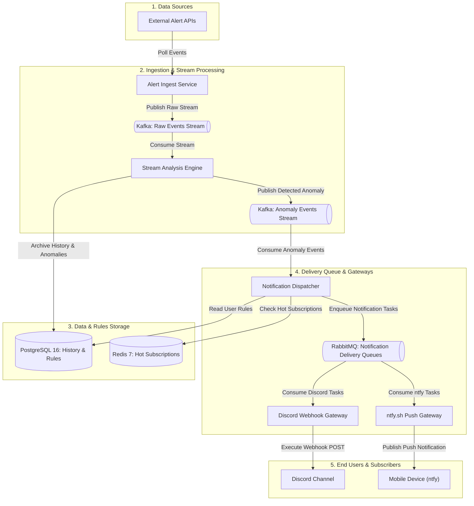
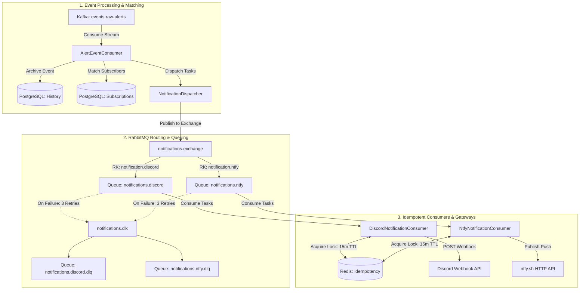

# Lodestar 🧭

[](https://github.com/Olezha/Lodestar/actions/workflows/ci.yml)

**Lodestar** is a real-time event ingestion, historical archiving, and anomaly notification platform built on Java 21 and Spring Boot 3.3+.

---

## Domain & Core Business Concept

1. **Event Ingestion & Archiving:** Continuous collection of real-time state changes and durable time-series archiving for deep statistical analysis and research data sets.
2. **Automated Stream Analysis:** Real-time processing and preliminary anomaly detection on incoming event flows.
3. **Conditional Notification Dispatch:** Multi-channel alert routing (e.g., Discord Webhook, ntfy.sh) triggered upon specific threshold conditions or detected anomalies, with guaranteed delivery and retries.

---

## Architecture & Tech Stack


```mermaid
flowchart TD
    subgraph DataSources["1. Data Sources"]
        AlertAPI[External Alert APIs]
    end

    subgraph StreamingPipeline["2. Ingestion & Stream Processing"]
        Ingest[Alert Ingest Service]
        KafkaRaw@{ shape: h-cyl, label: "Kafka: Raw Events Stream" }
        StreamEngine[Stream Analysis Engine]
        KafkaAnomalies@{ shape: h-cyl, label: "Kafka: Anomaly Events Stream" }
    end

    subgraph DataStorage["3. Data & Rules Storage"]
        DB[(PostgreSQL 16: History & Rules)]
        Cache[(Redis 7: Hot Subscriptions)]
    end

    subgraph DeliveryPipeline["4. Delivery Queue & Gateways"]
        Dispatcher[Notification Dispatcher]
        RabbitMQ@{ shape: h-cyl, label: "RabbitMQ: Notification Delivery Queues" }
        DiscordGateway[Discord Webhook Gateway]
        NtfyGateway[ntfy.sh Push Gateway]
    end

    subgraph EndUsers["5. End Users & Subscribers"]
        DiscordClient["Discord Channel"]
        MobileClient["Mobile Device (ntfy)"]
    end

    %% Ingestion Flow
    AlertAPI -->|Poll Events| Ingest
    Ingest -->|Publish Raw Stream| KafkaRaw

    %% Processing & Analysis Flow
    KafkaRaw -->|Consume Stream| StreamEngine
    StreamEngine -->|Archive History & Anomalies| DB
    StreamEngine -->|Publish Detected Anomaly| KafkaAnomalies

    %% Dispatch Flow
    KafkaAnomalies -->|Consume Anomaly Events| Dispatcher
    Dispatcher -->|Read User Rules| DB
    Dispatcher -->|Check Hot Subscriptions| Cache
    Dispatcher -->|Enqueue Notification Tasks| RabbitMQ

    %% Delivery Flow
    RabbitMQ -->|Consume Discord Tasks| DiscordGateway
    RabbitMQ -->|Consume ntfy Tasks| NtfyGateway
    DiscordGateway -->|Execute Webhook POST| DiscordClient
    NtfyGateway -->|Publish Push Notification| MobileClient
```

### Architectural Rationale

For a detailed architectural analysis on why **Apache Kafka** (Event Streaming) and **RabbitMQ** (Task Queue)
were selected together in this system, read the engineering article:
[RabbitMQ & Kafka: Historical Evolution & Architectural Choices (in Ukrainian)](https://olehshklyar.com/2609-rabbitmq-and-kafka)

### Tech Stack:
* **Language & Runtime:** Java 21, Spring Boot 3.3+ (Spring Data JPA, Spring Security, Spring Web, RestClient)
* **Event Streaming:** Apache Kafka (KRaft mode, spring-kafka)
* **Message Queue:** RabbitMQ (spring-amqp, AMQP 0-9-1, DLX & Retry Exchanges)
* **Persistence & Caching:** PostgreSQL 16, Flyway 10, Redis 7
* **Orchestration & Cloud:** Docker, Kubernetes (Deployments, Services, Ingress, HPA), Helm
* **Observability:** Prometheus, Grafana, Spring Boot Actuator, Micrometer Observation API
* **Testing:** Testcontainers (Kafka, RabbitMQ, PostgreSQL), JUnit 5, AssertJ

---

## Quickstart & Local Development

### 1. Run Infrastructure Dependencies (Docker Compose)
`docker-compose.yml` manages all external services (PostgreSQL, Redis, Kafka KRaft, RabbitMQ) independently of the Java application:

* **Start all infrastructure services:**
  ```bash
  docker compose up -d
  ```

### 2. Run the Application

* **Via IDE:** Run or debug `LodestarApplication.main()`.
* **Via CLI:**
  ```bash
  ./gradlew bootRun
  ```

### Useful Infrastructure Commands:

* **Check running container status:**
  ```bash
  docker compose ps
  ```

* **View service logs:**
  ```bash
  # Follow logs across all services
  docker compose logs -f

  # Follow logs for a specific service
  docker compose logs -f rabbitmq # or postgres, redis, kafka
  ```

* **Interactive database & cache CLIs:**
  ```bash
  # Open PostgreSQL interactive terminal (psql)
  docker compose exec postgres psql -U postgres -d lodestar_db

  # Open Redis interactive CLI
  docker compose exec redis redis-cli
  ```

* **Stop infrastructure:**
  ```bash
  docker compose down
  ```

* **Stop and wipe volume data (fresh start):**
  ```bash
  docker compose down -v
  ```

### Services & Endpoints:
* [**Swagger UI**](http://localhost:8080/swagger-ui.html)
* [**Actuator Health**](http://localhost:8080/actuator/health)
* [**RabbitMQ Management UI**](http://localhost:15672) (guest / guest)
* **PostgreSQL:** `localhost:5432` (db: `lodestar_db`, user: `postgres`)
* **Redis:** `localhost:6379`
* **Apache Kafka (KRaft):** `localhost:9092`

---

## Notification Delivery Channels & Push Gateways

Lodestar implements a decoupled, asynchronous notification pipeline that transforms streaming anomaly events into targeted user notifications across external delivery channels.

### Architecture & Pipeline Interconnectivity


```mermaid
flowchart TD
    subgraph CorePipeline["1. Event Processing & Matching"]
        Kafka["Kafka: events.raw-alerts"] -->|Consume Stream| AEC["AlertEventConsumer"]
        AEC -->|Archive Event| DB[("PostgreSQL: History")]
        AEC -->|Match Subscribers| SubRepo[("PostgreSQL: Subscriptions")]
        AEC -->|Dispatch Tasks| Disp["NotificationDispatcher"]
    end

    subgraph AMQP["2. RabbitMQ Routing & Queuing"]
        Disp -->|Publish to Exchange| Ex["notifications.exchange"]
        Ex -->|RK: notification.discord| QDiscord["Queue: notifications.discord"]
        Ex -->|RK: notification.ntfy| QNtfy["Queue: notifications.ntfy"]
        QDiscord -.->|On Failure: 3 Retries| DLX["notifications.dlx"]
        QNtfy -.->|On Failure: 3 Retries| DLX
        DLX --> DLQDiscord["Queue: notifications.discord.dlq"]
        DLX --> DLQNtfy["Queue: notifications.ntfy.dlq"]
    end

    subgraph Consumers["3. Idempotent Consumers & Gateways"]
        QDiscord -->|Consume Tasks| DiscordCons["DiscordNotificationConsumer"]
        QNtfy -->|Consume Tasks| NtfyCons["NtfyNotificationConsumer"]
        DiscordCons <-->|Acquire Lock: 15m TTL| Redis[("Redis: Idempotency")]
        NtfyCons <-->|Acquire Lock: 15m TTL| Redis
        DiscordCons -->|POST Webhook| DiscordClient["Discord Webhook API"]
        NtfyCons -->|Publish Push| NtfyClient["ntfy.sh HTTP API"]
    end
```

#### Pipeline Data Flow:
1. **Ingestion & Historical Persistence:** Incoming events from Kafka (`events.raw-alerts`) are consumed by `AlertEventConsumer`. Every event is immediately archived to the immutable PostgreSQL event history log (`alert_event_history`).
2. **Subscription Matching & Filtering:** Active subscriptions for the matching `regionId` are queried from `alert_subscriptions`. Subscriptions whose `minSeverity` exceeds the incoming event severity are filtered out.
3. **AMQP Task Dispatching:** For each matched subscriber, `NotificationDispatcher` publishes an asynchronous `NotificationTask` to `notifications.exchange`.
4. **Resilient Routing & Retries:**
   * Messages are routed by channel key (`notification.discord`, `notification.ntfy`).
   * Listener containers run with pooled channel concurrency (`concurrency: 2`, `max-concurrency: 5`, `prefetch: 10`).
   * Transient network errors trigger exponential retries (up to 3 attempts). Exhausted or poison messages are forwarded to the Dead Letter Exchange (`notifications.dlx`) and stored in dedicated DLQs (`*.dlq`) for manual inspection.
5. **Distributed Deduplication (Redis Idempotency):**
   * Before executing external network requests, consumers query `IdempotencyService`.
   * An atomic Redis key (`dedup:notification:<taskId>`) is acquired with a 15-minute sliding TTL. Redelivered AMQP messages or broker reconnect duplicates are safely dropped.
6. **Delivery Execution:** The respective HTTP client (`DiscordClientImpl` or `NtfyClientImpl`) issues an HTTP request using Spring 6 `RestClient`. In `dry-run` mode, network calls are intercepted and logged without reaching external services.

---

### Configuration Reference (`application.yml` / `.env`)

All channel configurations are externalized into environment variables with safe defaults:

| Variable | Default Value | Description |
| :--- | :--- | :--- |
| `DISCORD_WEBHOOK_URL` | *(empty)* | Fallback Discord webhook URL if not provided per-subscription |
| `DISCORD_USERNAME` | `Lodestar Alerts` | Sender display name appearing on Discord messages |
| `DISCORD_DRY_RUN` | `true` | When `true`, logs payloads without sending outbound Discord requests |
| `NTFY_SERVER_URL` | `https://ntfy.sh` | Base URL of the ntfy instance (public or self-hosted) |
| `NTFY_DEFAULT_TOPIC` | `lodestar-alerts` | Fallback topic if recipient address is empty |
| `NTFY_DRY_RUN` | `true` | When `true`, logs payloads without sending outbound ntfy requests |

---

### Discord Webhook Setup & Integration Guide

Discord Webhooks provide a zero-infrastructure way to route alerts into dedicated Discord channels with real-time push notifications to Discord desktop and mobile clients.

#### Step 1: Create a Discord Webhook
1. Open your Discord server and navigate to the channel where alerts should appear.
2. Go to **Channel Settings** (gear icon) -> **Integrations** -> **Webhooks**.
3. Click **New Webhook**, assign a name (e.g. `Lodestar Alerts`), and click **Copy Webhook URL**.

#### Step 2: Configure Environment Variables
Copy `.env.example` to `.env` and set:
```bash
DISCORD_WEBHOOK_URL=https://discord.com/api/webhooks/1234567890/your-webhook-token
DISCORD_USERNAME="Lodestar Alerts"
DISCORD_DRY_RUN=false
```

#### Step 3: Register a Discord Alert Subscription
Create a user subscription specifying `DISCORD` as the delivery channel and the webhook URL as the `recipientAddress`:
```bash
curl -X POST http://localhost:8080/api/v1/subscriptions \
  -H "Content-Type: application/json" \
  -d '{
    "userId": "discord-ops-user",
    "channel": "DISCORD",
    "recipientAddress": "https://discord.com/api/webhooks/1234567890/your-webhook-token",
    "regionId": "KYIV_REGION",
    "minSeverity": "WARNING"
  }'
```

#### Step 4: Publish an Alert and Verify
Simulate an alert event to trigger the pipeline:
```bash
curl -X POST http://localhost:8080/api/v1/alerts \
  -H "Content-Type: application/json" \
  -d '{
    "regionId": "KYIV_REGION",
    "eventType": "Air Raid Alert",
    "severity": "CRITICAL"
  }'
```
*Result:* The alert message is published to Kafka, routed through RabbitMQ, deduplicated via Redis, and delivered to your Discord channel.

---

### ntfy.sh Mobile Push Setup & Integration Guide

`ntfy.sh` is an open-source, subscription-based push notification service. It requires no user accounts, API keys, or registration, making it ideal for instant push notifications to mobile devices.

#### Step 1: Install the Mobile Application
* Install the free, open-source **ntfy** application from your mobile application store (or use the web client directly in your browser at `https://ntfy.sh`).

#### Step 2: Subscribe to a Topic
1. Open the **ntfy** mobile application.
2. Tap the `+` button to add a new subscription.
3. Enter a unique topic name that is difficult to guess (e.g., `lodestar-kyiv-alerts-7821`).

#### Step 3: Configure Environment Variables
In `.env`, configure the server URL and set `dry-run` to `false`:
```bash
NTFY_SERVER_URL=https://ntfy.sh
NTFY_DEFAULT_TOPIC=lodestar-kyiv-alerts-7821
NTFY_DRY_RUN=false
```

#### Step 4: Register an ntfy.sh Alert Subscription
Register a subscription with `channel: "NTFY"` and your chosen topic name as `recipientAddress`:
```bash
curl -X POST http://localhost:8080/api/v1/subscriptions \
  -H "Content-Type: application/json" \
  -d '{
    "userId": "mobile-subscriber-1",
    "channel": "NTFY",
    "recipientAddress": "lodestar-kyiv-alerts-7821",
    "regionId": "KYIV_REGION",
    "minSeverity": "INFO"
  }'
```

#### Step 5: Publish an Alert and Verify Priority Delivery
Publish a test alert event:
```bash
curl -X POST http://localhost:8080/api/v1/alerts \
  -H "Content-Type: application/json" \
  -d '{
    "regionId": "KYIV_REGION",
    "eventType": "Air Raid Alert",
    "severity": "CRITICAL"
  }'
```
*Priority Mapping Behavior on Mobile:*
* `CRITICAL` events trigger `urgent` priority in ntfy, which rings the high-priority alarm sound and bypasses Do Not Disturb mode on supported devices.
* `WARNING` events trigger `high` priority notifications.
* `INFO` events trigger standard `default` priority push notifications.

---

## Testing

Run the automated test suite (unit tests and containerized integration tests):

```bash
./gradlew test
```

> **Note:** Integration tests utilize **Testcontainers** to automatically provision and dispose of isolated Kafka, RabbitMQ, Redis, and PostgreSQL instances during test runs. Pre-existing `docker compose` services are not required for test execution.
